# Lab 01 Report - Introduction to Open Source Software

## 6. Open Source Definition
        These criteria are important because they make sure that open source projects fulfill what they are 
        intended to do.  This makes them more likely to be used because there is less risk of using a piece 
        of open source code and then running into troubles as a result of using it.  With these criteria if 
        an individual or buisness choose to make use of a piece of open source code they know that they do
        not have to worry about be procluded from using it in the future.
## 7. Smart Questions- Additional Tips for Answering Questions
        One additional tip that is always very helpful is to include links to more information about anything
        used in the solution.  This allows the person who asked the question to not have to ask/search for follow
        up information just to understand the solution you give.  Instead they are able to see exactly what you
        are trying to do by looking at those links.
        Another helpful tip is when the qustion is about help finding a bug in their code it is helpful to
        explain the logic used to find the bug so that they can truly understand what went wrong because
        chances are if you just show them the change without the reason they will be likely to either make the
        same mistake again somewhere else or try and use your solution as a black box for anytime they need to
        do something similar when in reality what they had makes more sense in other instances.
## 8. Free Culture
        Overall this chapter is a big warning about the potential risks associated with writing software .
        One of the main take aways from this chapter is that you never know how your code will be used.  Once
        it has been made public the users will decide its use no matter what your initial purpose might have been
        and as a result you have to be careful to distance yourself from the bad actors that use your code.  Another
        take away from the chapter is that large lobbies have the power to cost you a lot of money if you do anything
        to cross them even if  what you do seems small. As a result when writing software with the intention of 
        distributing it to other people try and predict ways that it might be used in a manner that can get you sued
        and explicitly state not to do that so that you have an added layer of protection from their lawsuits. 
        A third take away si that it is best to learn the applicable laws for any software you are writing so
        that you know ahead of time what risks you might be taking by distributing the code. This can also help
        with designing your software to warn the users as well of pottential legal issues if they use your
        software in a mannor other than its initial purpose. All of these take aways can basically be summed up into
        one key tip: "Know what you are getting into before publishing any software for the public."
        
## 13 Tree on linux

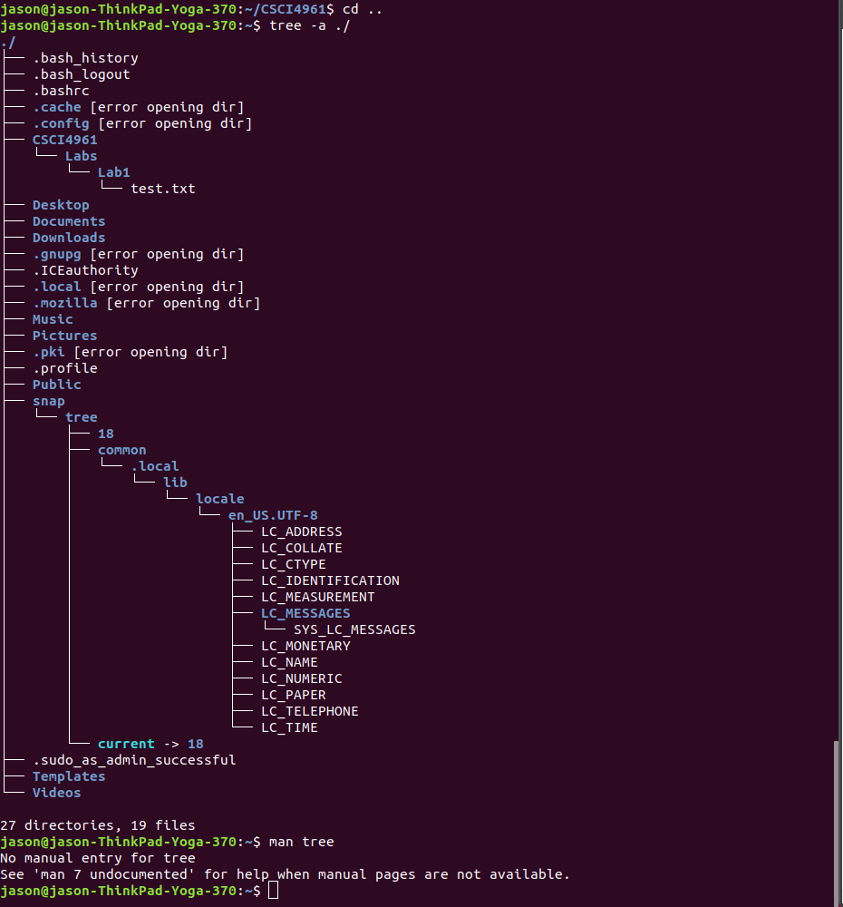

## 15. RegexOne
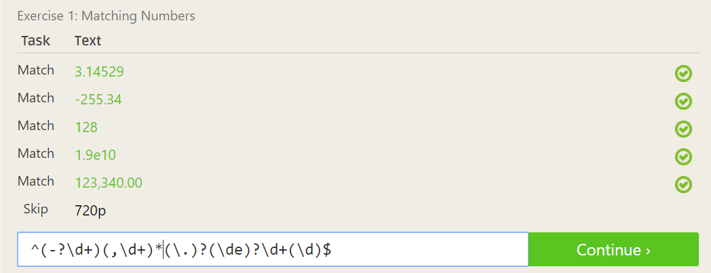
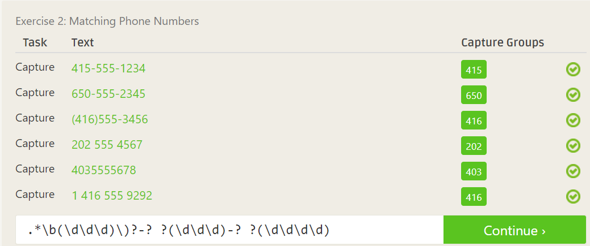
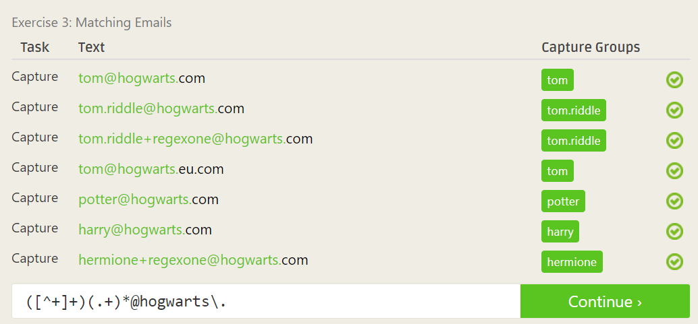
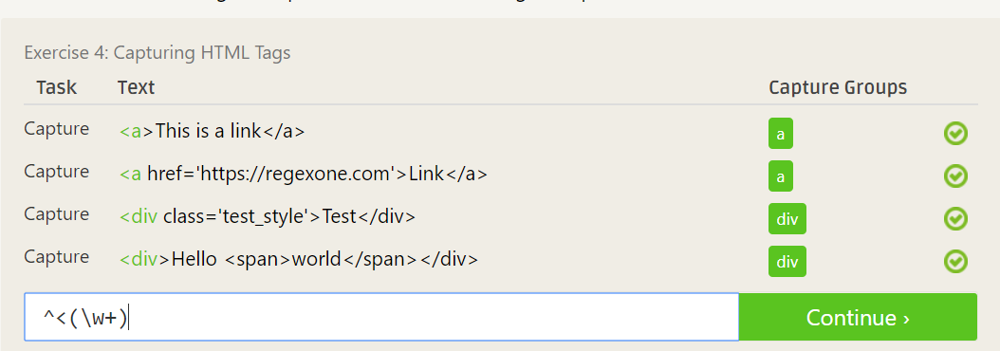
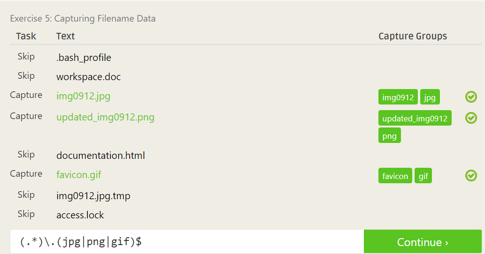
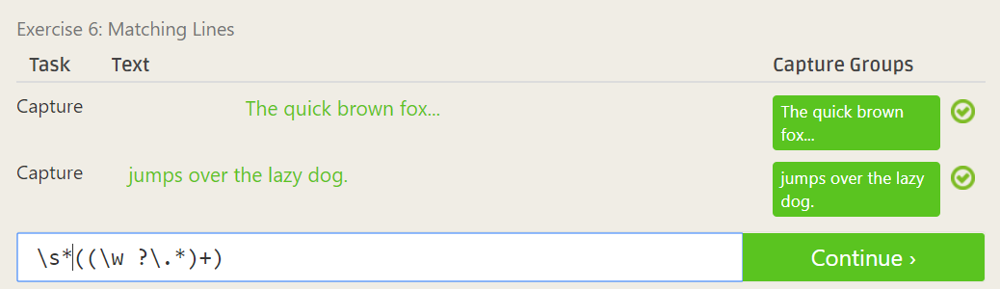
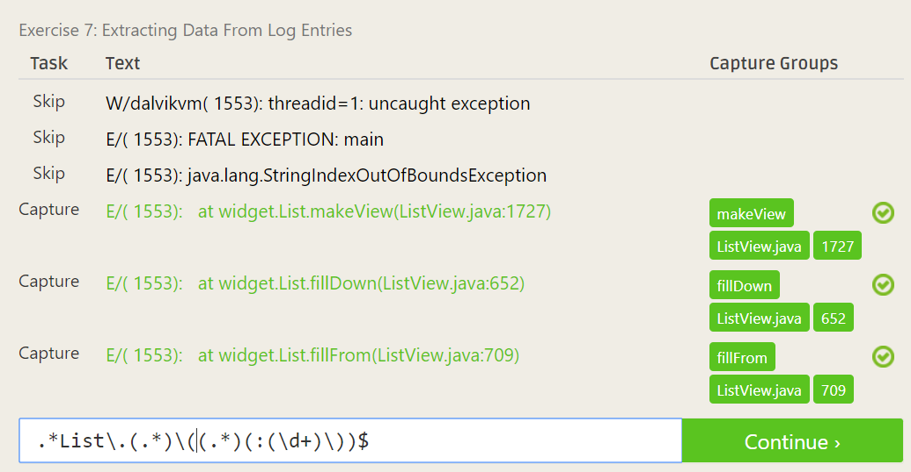

## 16. Regex Crosswords

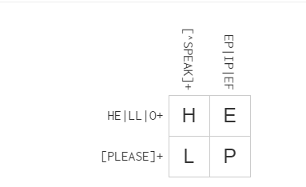
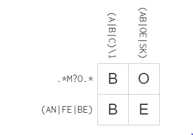
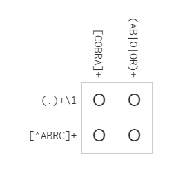
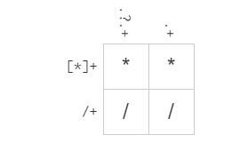

## 18. Blocky Games

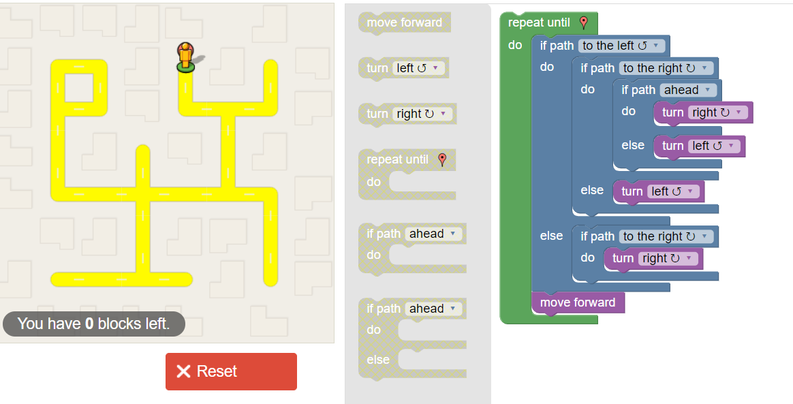

## 19. Reflection
        One of the projects that I have started to examine is API for the music database discogs. This API theoretically 
        should allow for a query of the database but as of right now its documentation is less than helpfull in starting to use it.
        I found this when I was searching for a way to take a spotify playlist and find the median year for all the
        songs in the playlist. One way this open source project could be helped is to add documentation for functionality
        beyond just the initial connection to the server. As it stands right now after finishing connecting the documentation 
        just says ise python dir() to figure everything else out. The problem with this is the database querys do not return 
        valid songs and the serial numbers used on the website do not appear to be the same in the API.  Both of these bugs 
        can be examined and doccumented so that future people trying to use this API have an easier time. I also looked at
        some of the RCOS projects to see if any of them were interesting and I found the PhoneControler project to be somewhat
        intersting because the applications of that can be very large especially in a classroom learning environment.  This is 
        because it could allow  an entire class to participate in an activity without the need for a large cost for controllers
        for the school. Either the students would already have one or at the very least the school could purchase tablets that
        would not have a single purpose like a controller.
        
