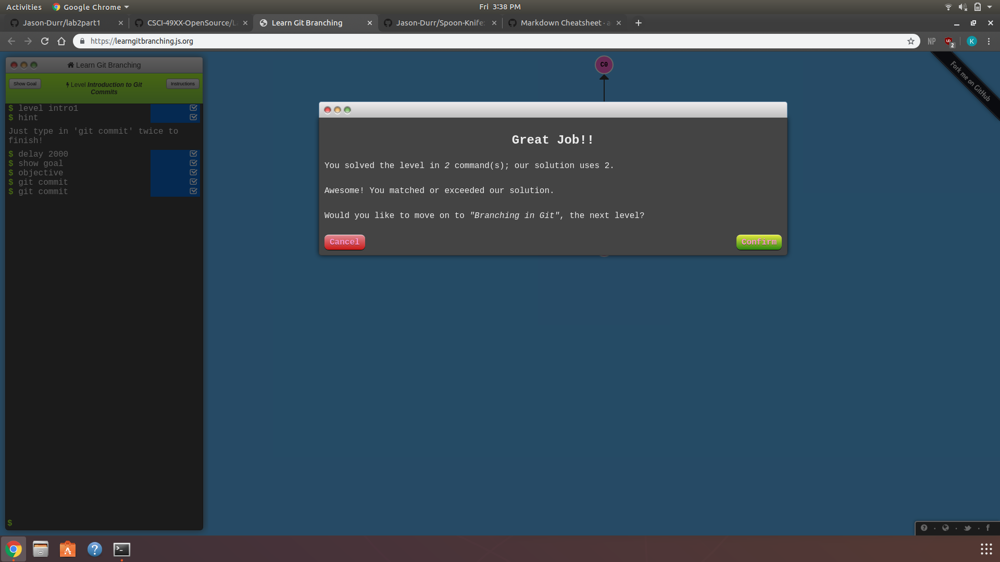
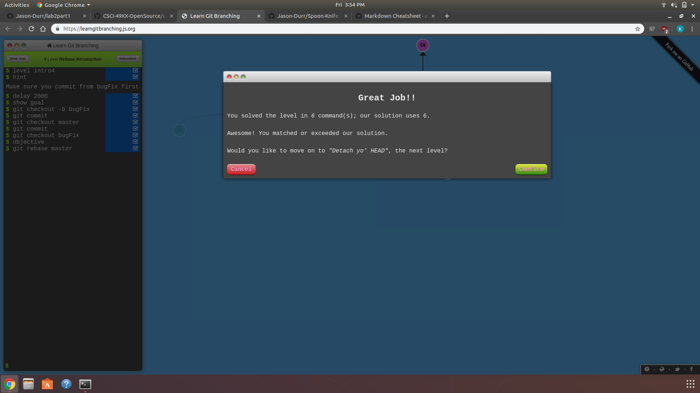
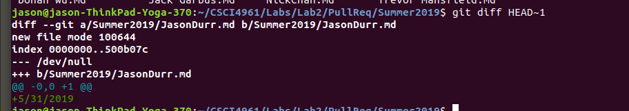
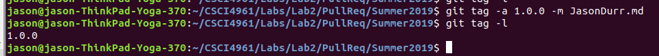

## Part 1 repository
Here is the repository for the first part.
https://github.com/Jason-Durr/lab2part1

This is the screenshot of the branching diagram and git log

## Part 2
The link to my forked spoon knife
https://github.com/Jason-Durr/Spoon-Knife
These are the screenshots from 

## Part 3
Here is the pull-req repository:
https://github.com/Jason-Durr/PullReq
Here are the two screenshots for part 3:

Here is a link to the common repository: https://github.com/oakleyaidan21/OSSProjectIdeas

