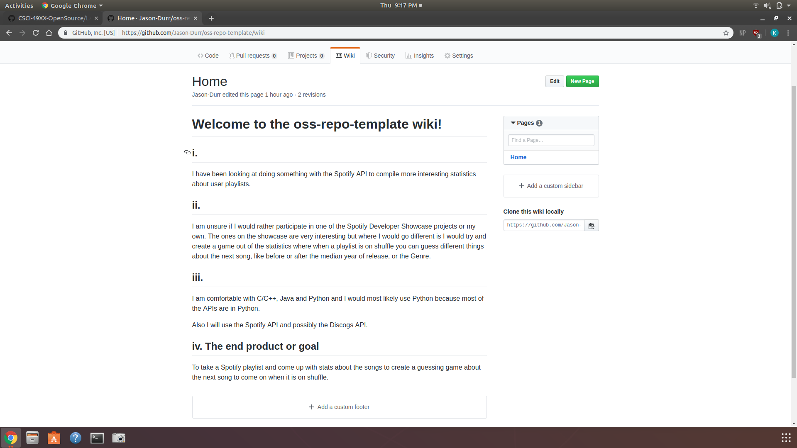
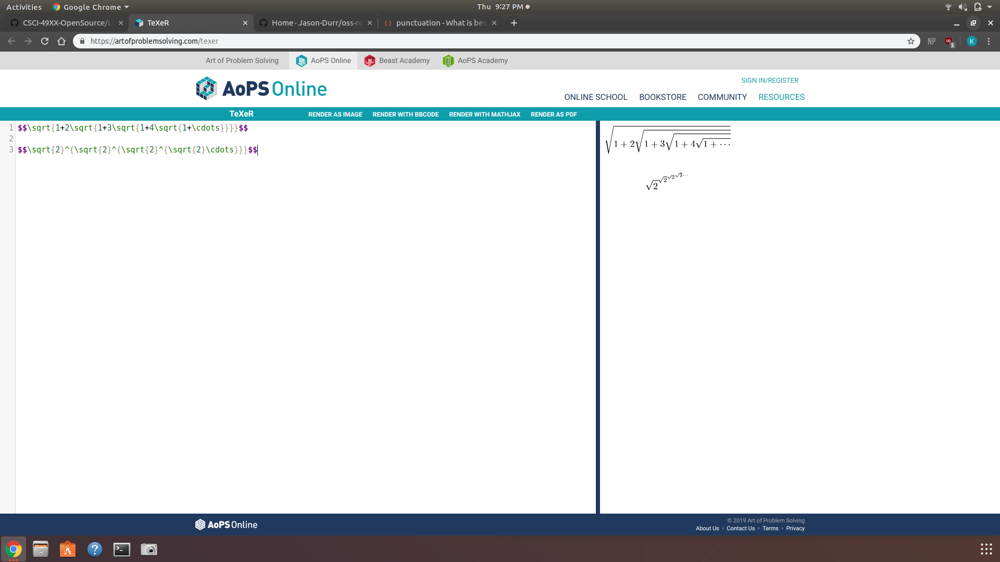
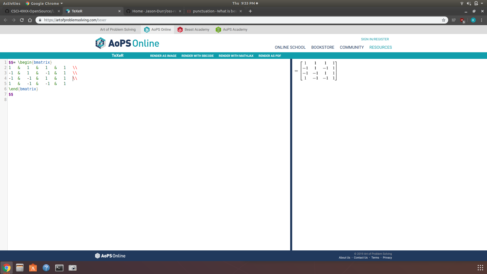
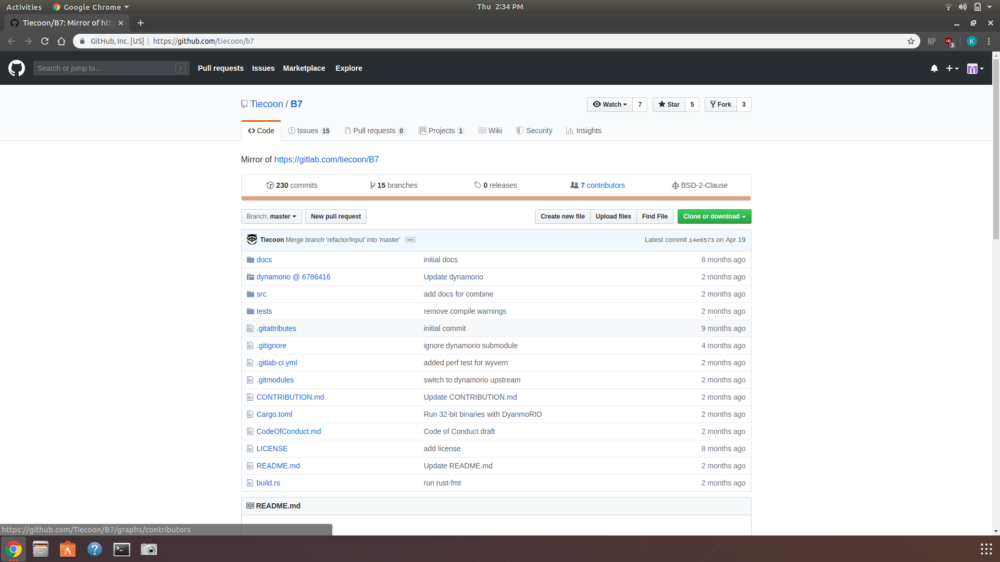
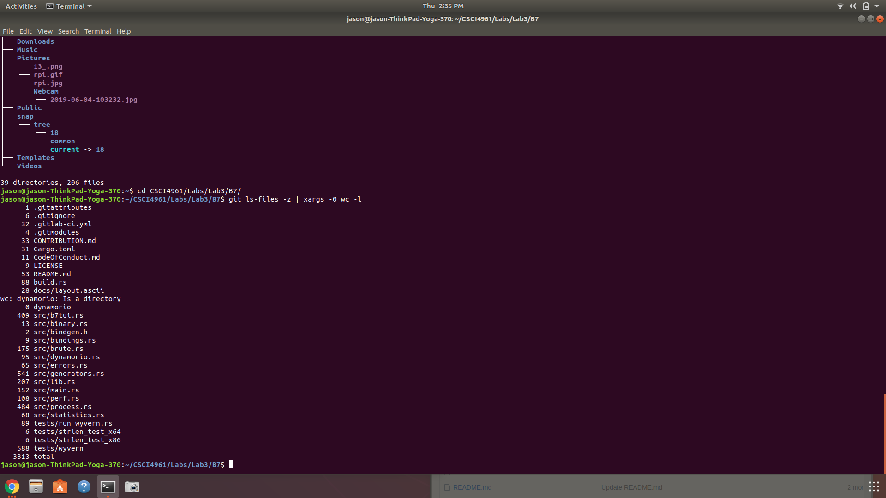
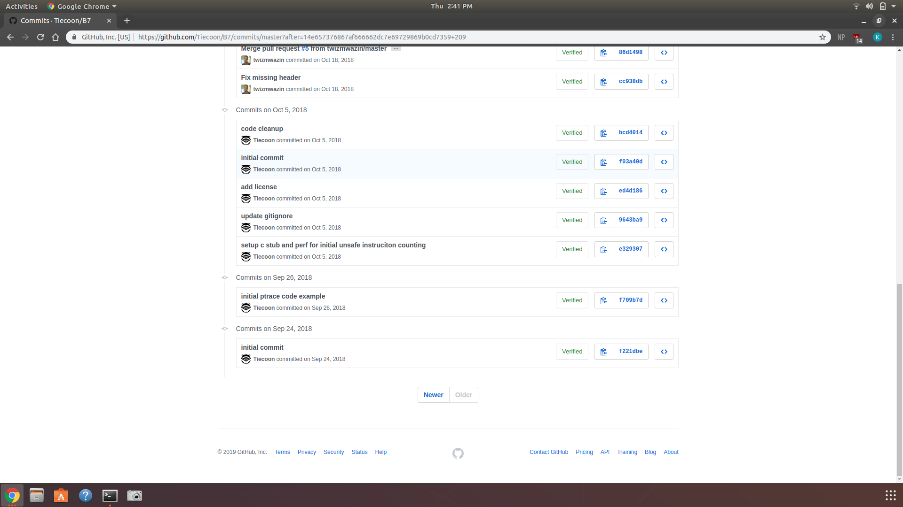
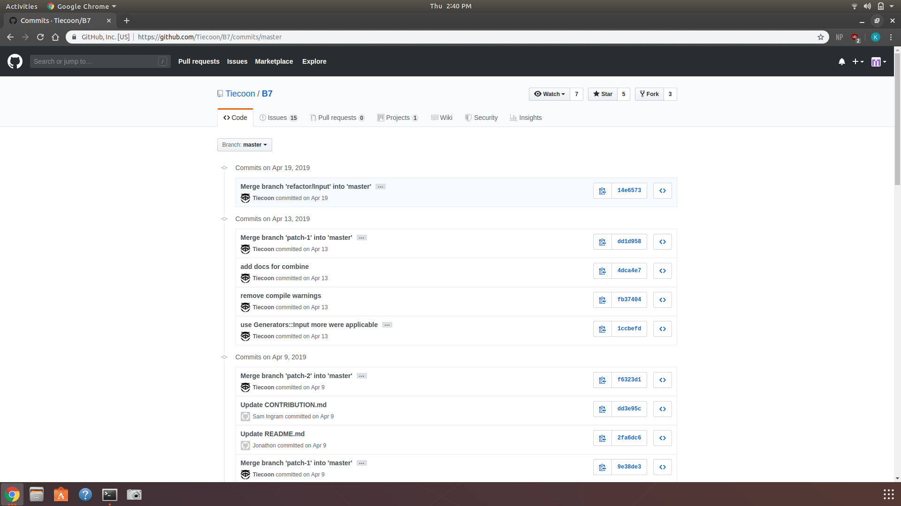
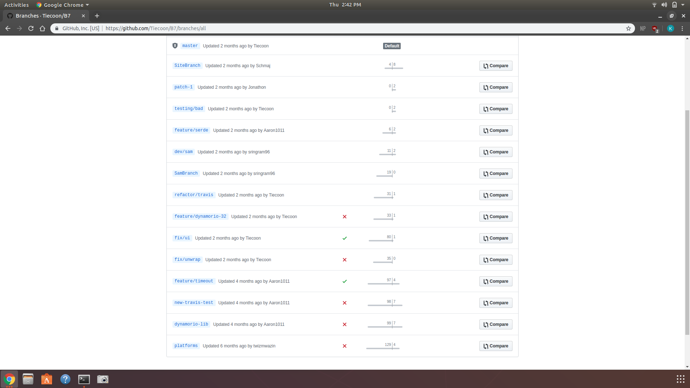
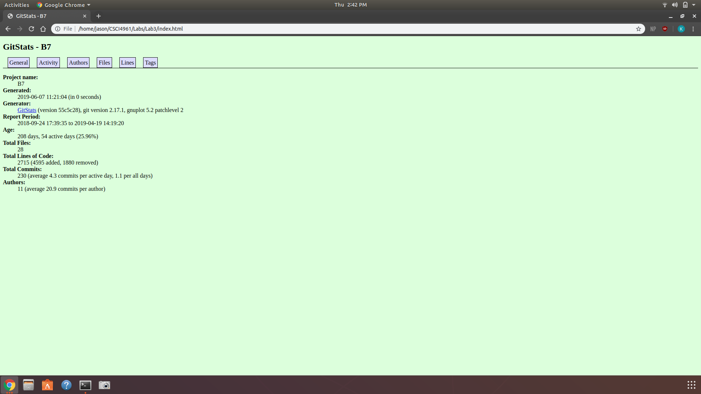
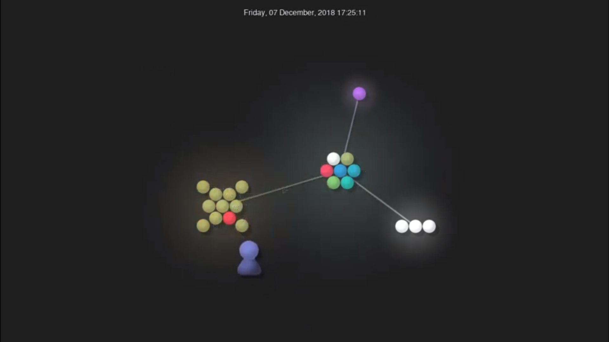

# Lab 3

## Part1  Documentation

### 1. Wiki

### 2. Latex Equation

### 3. Latex Matrix

## Part 2 Community

## B7

### 4. By Hand

Contributors: 7

Line of Code: 3313

First Commit: September 24 2018

Last Commit: April 19 2019

Number of Branches: 15

### 5. GitStats

Contributors: 11

Lines of Code: 2715

First Commit: September 24 2018

Last Commit: April 19 2019

GitStats said there were 4 more contributors and about 600 fewer lines of code than what was found by hand on Github and using the command line argument. Git stats also does not have a way to see the number of branches of the repository.

### 6. Visualization

Full Video:
https://youtu.be/lEQv5MFRvis]

Link to other groupmembers:
https://github.com/ChrisReed0114/OSS-Repo/tree/master/lab3-contrib
