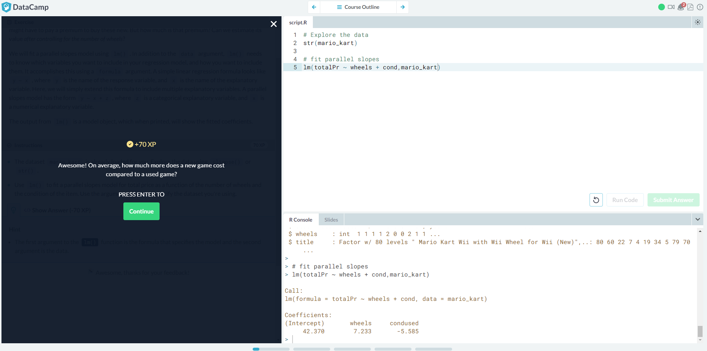

# Lab 8

## Screen shots from the Data Visualization with ggplot2 (Part 1) introduction on DataCamp

## Screen shots from the Multiple and Logistic Regression intrduction on DataCamp

## A pointer to your open source project on Observatory

https://rcos.io/projects/flomv2/flom/profile
